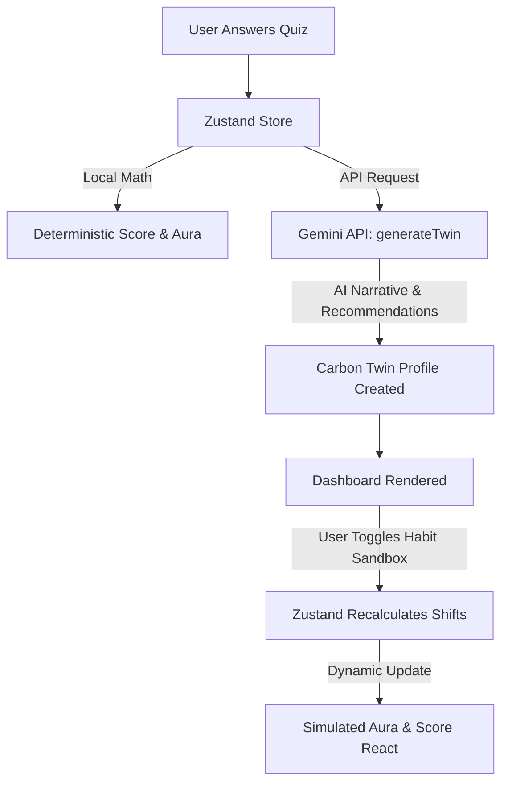

# Carbon Twin AI™ 🌍✨

> **A Personalized Digital Twin Simulator & AI Carbon Coach**
> Built for the PromptWars Challenge 3. Combines deterministic scientific math, real-time habit simulation, and context-aware generative AI into one seamless single-scroll experience.

---

## 🌟 Project Overview

**Carbon Twin AI™** is a digital twin simulator that translates the abstract concept of carbon footprints into an emotional, interactive, and actionable journey. Most carbon calculators suffer from complex data entry, boring grids, and generic advice. Carbon Twin AI™ solves this by generating a personalized digital twin in under 60 seconds using only 5 key lifestyle questions, showing you how your current habits project into the future, and giving you an AI Carbon Coach to help you reform them.

### 🎯 Target Persona
* **Primary**: Young professionals, students, and remote workers looking for rapid, visual feedback.
* **Secondary**: Families and eco-conscious learners looking to simulate how domestic shifts (like electric vehicles or solar panels) impact their long-term footprint.

---

## 🎯 Challenge Alignment (PromptWars Challenge 3)

The project is designed to stand out in the PromptWars competition by focusing on:
1. **Low Friction**: Get an actionable footprint assessment and meet your "Carbon Twin" in under a minute.
2. **Emotional Engagement**: The **Life Replay** chapter narrative and visceral **Earth Consequences** make the numbers feel immediate and human.
3. **Interactive Simulation**: The **Habit Sandbox** allows judges and users to toggle lifestyle changes (e.g., eating plant-based, installing solar panels) and watch their twin's Aura react in real-time.
4. **Resiliency & Fallbacks**: If the Gemini API is unavailable, the application gracefully degrades to local heuristic recommendations and pre-written chapters without crashing.

---

## 🚀 Key Features

### 1. Deterministic Digital Twin & Carbon Auras
Evaluates diet, transit, home energy, travel, and shopping patterns to calculate your footprint in annual CO2e tonnes. Based on scientific carbon thresholds, users are assigned a deterministic **Carbon Aura**:
* 🟢 **Green Aura** ($\le 2.0$ tonnes): Paris Agreement individual target.
* ❇️ **Emerald Aura** ($\le 4.5$ tonnes): Moderate footprint, below Western averages.
* 🔵 **Sapphire Aura** ($\le 8.0$ tonnes): Average footprint for European/urban lifestyles.
* 🟡 **Amber Aura** ($\le 15.0$ tonnes): High footprint, typical of frequent flyers/commuters.
* 🔴 **Crimson Aura** ($> 15.0$ tonnes): Critical footprint, requiring immediate habit reform.

### 2. Real-Time Habit Sandbox
Interact with toggles and sliders to simulate shifting habits (e.g. commuting by EV, switching to a green energy tariff, going vegetarian) and watch your twin's score and Aura recalculate in real-time.

### 3. Visceral Earth Consequences
Translates abstract carbon figures into visual, real-world consequences scaled to 10,000 people living similarly:
* **Arctic Ice Melted** (in square meters of ice sheet)
* **Tree-Years Required** (years of mature tree absorption)
* **Transatlantic Flights** (equivalent emissions in air travel)
* **Total Energy Footprint** (in kilowatt-hours)

### 4. AI Carbon Coach (Powered by Gemini 2.5)
A direct conversational agent built using the `@google/generative-ai` SDK. The coach is context-aware: it knows your assigned Aura, your exact annual score, and your habit history, tailoring all advice specifically to your profile.

### 5. Interactive Purification Quests
Gamified real-world checklists (e.g. "Unplug Vampire Electronics," "Meatless Monday," "Line-Dry Clothes"). Completing quests directly saves carbon, which is subtracted from your twin's score, dynamically updating your aura and progress.

### 6. Green Future Comparison
Side-by-side projections over a 5-year period comparing your current lifestyle trajectory against an improved lifestyle trajectory. Shows cumulative CO2 saved, monetary savings (USD), and health score indicators.

---

## 🏗️ Technical Architecture

### 📂 Directory Structure
```
carbonfootprint/
├── .github/              # CI/CD workflows
├── docs/                 # Architectural specifications
│   └── MASTER_IMPLEMENTATION_PLAN.md
├── public/               # Asset files (e.g. earth-texture, metadata)
├── src/
│   ├── app/              # Next.js App Router (pages and api endpoints)
│   │   ├── api/
│   │   │   ├── carbon-coach/   # Gemini Chat endpoint
│   │   │   └── generate-twin/  # Gemini Twin Narrative generator
│   │   ├── about/        # Methodology & research sources
│   │   ├── app/          # Core Digital Twin dashboard
│   │   ├── science/      # Interactive documentation on thresholds
│   │   └── layout.tsx
│   ├── components/       # Custom React component components
│   │   ├── aura/         # Aura reveal components
│   │   ├── coach/        # AI Coach chat interface
│   │   ├── consequence/  # Earth consequences display
│   │   ├── dashboard/    # Main app layout and sandbox tabs
│   │   ├── quiz/         # Multi-step intake form
│   │   ├── simulator/    # Sandbox toggles and sliders
│   │   ├── timeline/     # Recharts projection timeline
│   │   ├── twin/         # Twin details and breakdown charts
│   │   └── ui/           # Premium glassmorphic custom UI elements
│   ├── lib/              # Core utility modules
│   │   ├── carbon-engine.ts # Deterministic carbon calculations
│   │   ├── rate-limit.ts    # API rate-limiter
│   │   └── gemini.ts        # Gemini API client wrapper
│   └── store/            # State management
│       └── carbon-store.ts  # Zustand store with persisted storage
├── tests/                # Vitest verification suites
└── package.json
```

### ⚡ State & Event Flow


### 🔒 Security Implementations
* **Rate Limiting**: API routes `/api/generate-twin` and `/api/carbon-coach` run server-side in-memory rate-limiting per IP address to safeguard Gemini quotas.
* **HTTP Security Headers**: Next.js config enforces Content Security Policy (CSP), clickjacking protection (`X-Frame-Options: DENY`), and mime-sniffing safeguards (`X-Content-Type-Options: nosniff`).
* **Input Validation**: All client payloads and Gemini JSON responses are validated through Zod schemas.

---

## 🛠️ Getting Started & Setup

### Prerequisites
* **Node.js** (v18.x or later recommended)
* **Google Gemini API Key** (obtain from [Google AI Studio](https://aistudio.google.com/))

### Installation

1. **Clone the repository**:
   ```bash
   git clone https://github.com/maheshmm7/Carbon-Twin.git
   cd Carbon-Twin
   ```

2. **Install dependencies**:
   ```bash
   npm install
   ```

3. **Set up environment variables**:
   Create a `.env.local` file by copying the template:
   ```bash
   cp .env.example .env.local
   ```
   Open `.env.local` and add your Gemini API Key:
   ```env
   GEMINI_API_KEY=your_actual_gemini_api_key_here
   NEXT_PUBLIC_APP_URL=http://localhost:3000
   ```

4. **Run the development server**:
   ```bash
   npm run dev
   ```
   Open [http://localhost:3000](http://localhost:3000) with your browser.

---

## 🧪 Testing & Quality Commands

Ensure everything builds and works flawlessly with the following scripts:

* **Unit & Integration Tests**: `npx vitest run`
  * Runs the test suite in [tests/](file:///F:/carbonfootprint/tests). Includes verification of all **1,920 possible lifestyle combinations** in the carbon engine to ensure zero mathematical drift or NaN results.
* **TypeScript Compilation**: `npx tsc --noEmit`
* **Linter**: `npm run lint` (runs ESLint with Next.js configurations)
* **Production Build**: `npm run build`
* **React Doctor**: `npx react-doctor` (scans code for render loops, hook safety, and performance leaks)

---

## 🚀 Deployment Guide (Vercel)

1. Push your code to your GitHub repository.
2. In your Vercel Dashboard, click **New Project** and import the repository.
3. In the **Environment Variables** configuration, add:
   * `GEMINI_API_KEY`: *(your Gemini key from Google AI Studio)*
   * `NEXT_PUBLIC_APP_URL`: *(your Vercel deployment URL)*
4. Click **Deploy**. Vercel will build and distribute the Next.js app automatically.

---

## 🛡️ License

This project is licensed under the MIT License - see the [LICENSE](LICENSE) file for details.
